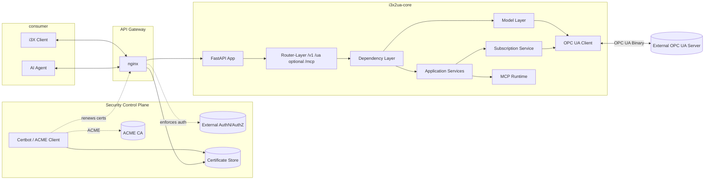
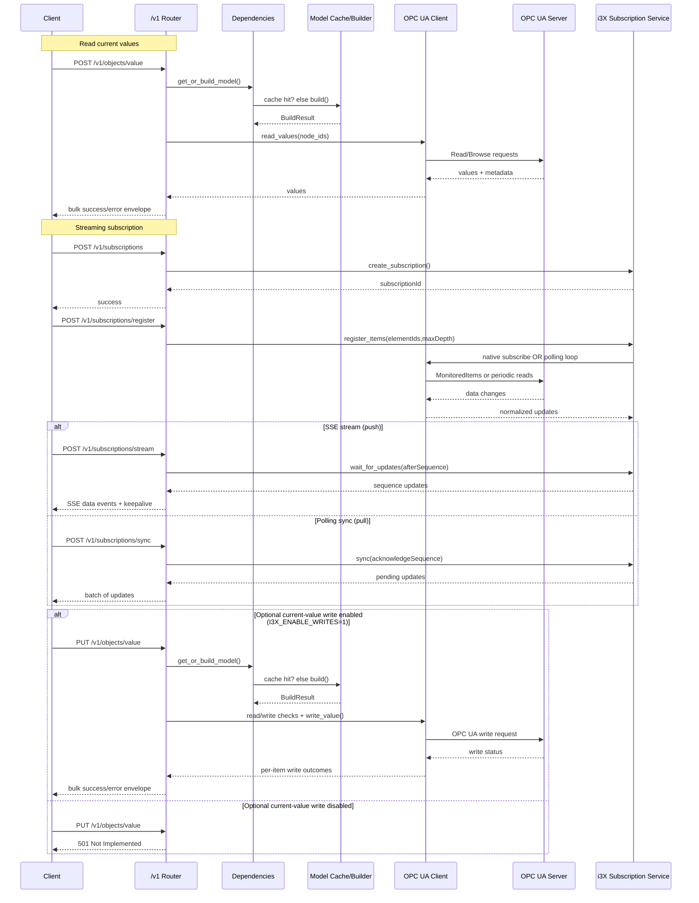

# The i3X API Gateway for OPC UA — REST, MCP & Real-Time Streaming

**FastAPI gateway implementing the i3X API over OPC UA — exposes OPC UA address spaces as standardized REST and MCP endpoints with JSON responses, OpenAPI docs, and Server-Sent Event subscriptions. Built for teams that do not have deep OPC UA expertise.**

[](https://github.com/AndreasHeine/i3x2ua/actions/workflows/docker.yml) [](https://github.com/AndreasHeine/i3x2ua/actions/workflows/quality.yml) [](https://codecov.io/gh/AndreasHeine/i3x2ua)


## **Industrial Information Interoperability eXchange (i3X)**

> The Industrial Information Interoperability Exchange (i3X™) is an open, common API initiative proposed to address a growing interoperability challenge in modern manufacturing architectures: **manufacturing data silo proliferation and API chaos**. As manufacturers adopt heterogeneous software stacks from multiple vendors, the industry risks repeating past fragmentation seen with protocols, platforms, and namespaces - this time at the API layer.

## Architecture Overview





## Quick Start

Requirements:

- Python 3.10 to 3.12
- uv
- Optional: running OPC UA server

Install dependencies:

```bash
uv sync --extra dev
```

Start API:

```bash
uv run uvicorn i3x_server.main:app --reload --host 127.0.0.1 --port 8000
```

Start without OPC UA server (PowerShell):

```powershell
$env:I3X_SKIP_OPCUA_CONNECT="1"
uv run uvicorn i3x_server.main:app --reload --host 127.0.0.1 --port 8000 --loop none
```

Enable MCP support explicitly when you want the `/mcp` endpoints and MCP tool catalog to be available:

```powershell
$env:I3X_ENABLE_MCP="1"
uv run uvicorn i3x_server.main:app --reload --host 127.0.0.1 --port 8000 --loop none
```

If you do not set `I3X_ENABLE_MCP`, the app starts without MCP support and `/mcp` returns `404`.

Use encrypted OPC UA with the included sample client certificate (development/testing):

```bash
uv run python scripts/generate_opcua_client_cert.py
```

```powershell
$env:I3X_OPCUA_SECURITY_MODE="SignAndEncrypt"
$env:I3X_OPCUA_SECURITY_POLICY="Basic256Sha256"
$env:I3X_OPCUA_CLIENT_CERT_PATH="./certs/opcua-client-sample/client-cert.pem"
$env:I3X_OPCUA_CLIENT_KEY_PATH="./certs/opcua-client-sample/client-key.pem"
uv run uvicorn i3x_server.main:app --reload --host 127.0.0.1 --port 8000 --loop none
```

The OPC UA server may require manually trusting the sample client certificate before the secure session can be established.

If you create your own OPC UA client certificates, ensure they include OPC UA-compatible SAN and key usage fields (application URI, DNS names, clientAuth EKU, and signing/encipherment key usages) and match the server's exposed security mode/policy.

OpenAPI/Swagger:

- http://127.0.0.1:8000/openapi.json
- http://127.0.0.1:8000/docs

When running the nginx reverse proxy from `docker compose up -d`, use `http://localhost:8080/` for the HTTP entrypoint or `https://localhost:8443/` for the HTTPS entrypoint. `8443` is mapped to nginx's TLS port, so `http://localhost:8443/` will return a 400 error by design.

## API Surface

Active endpoints are exposed under `/v1` for:

- info and metadata (`/info`, `/namespaces`, `/objecttypes`, `/relationshiptypes`)
- filtered type queries (`/objecttypes/query`, `/relationshiptypes/query`)
- object queries and values (`/objects`, `/objects/list`, `/objects/related`, `/objects/value`, `/objects/history`)
- subscriptions (`/subscriptions`, `/subscriptions/register`, `/subscriptions/unregister`, `/subscriptions/sync`, `/subscriptions/list`, `/subscriptions/delete`, `/subscriptions/stream`)

Current scope emphasis: this implementation prioritizes read/query/subscribe operations and includes optional current-value write support.

Optional OPC UA diagnostic endpoints are exposed under `/ua`:

- client state and connectivity (`/ua/state`, `/ua/connection`)
- session limits and metrics (`/ua/limits`, `/ua/metrics`)

Optional MCP endpoints are exposed only when `I3X_ENABLE_MCP=1`:

- SSE discovery and JSON-RPC 2.0 entry point (`GET /mcp`, `POST /mcp`)
- tool catalog and REST tool call (`/mcp/tools`, `/mcp/call`)
- prompt listing, definition, and execution (`/mcp/prompts`, `/mcp/prompts/{name}`, `/mcp/prompts/execute`)
- resource listing and reading (`/mcp/resources`, `/mcp/resources/read`)
- root listing (`/mcp/roots`)

MCP scope emphasis: the MCP bridge supports `initialize`, `tools/list`, `tools/call`, `prompts/list`, `prompts/get`, `resources/list`, `resources/read`, `roots/list`, and JSON-RPC 2.0 batch requests.

MCP write policy: `PUT` routes are intentionally excluded from MCP tool generation. Object writes are available via REST only.

## Current Limitations

- historical update APIs are not implemented (`PUT /v1/objects/history`, `PUT /v1/objects/{element_id}/history` return `501 Not Implemented`)
- `GET /v1/objects/{element_id}/history` currently returns `501 Not Implemented`
- current-value write support is optional and controlled by `I3X_ENABLE_WRITES`:
	- `I3X_ENABLE_WRITES=1`: `capabilities.update.current=true`, `PUT /v1/objects/value` enabled
	- default (`I3X_ENABLE_WRITES` unset/0): write endpoints return `501 Not Implemented`

## Docker

Quickstart (Docker image):

```bash
docker run -d --name i3x2ua-master -p 8080:8000 -e I3X_ENABLE_MCP=1 -e I3X_OPCUA_ENDPOINT=opc.tcp://opcua.umati.app:4843 ghcr.io/andreasheine/i3x2ua:master
```

Multiline (bash):

```bash
docker run -d \
	--name i3x2ua-master \
	-p 8080:8000 \
	-e I3X_ENABLE_MCP=1 \
	-e I3X_OPCUA_ENDPOINT=opc.tcp://opcua.umati.app:4843 \
	ghcr.io/andreasheine/i3x2ua:master
```

Run with compose:

```bash
docker compose up -d
```

Build your own image with an explicit server version for `/v1/info`:

```bash
docker build --build-arg BUILD_VERSION=1.1.0 -t i3x2ua:1.1.0 .
```

If `BUILD_VERSION` is not set, the API falls back to `master`.

The stack now starts the API behind an nginx reverse proxy. The app container stays internal, while nginx exposes HTTP and optional HTTPS.

The default compose setup also enables container hardening (`read_only`, `tmpfs`, dropped Linux capabilities, `no-new-privileges`).

Optional environment variables:

- `I3X_ENABLE_MCP=1` to enable MCP support; it is disabled by default
- `I3X_ENABLE_WRITES=1` to enable current-value writes (`PUT /v1/objects/value` and `PUT /v1/objects/{element_id}/value`)
- `I3X_OPCUA_CERTS_DIR=./certs` to mount OPC UA client/server certificate files into the app container (`/app/certs`)
- `NGINX_HTTPS_ENABLED=1` to enable TLS termination
- `NGINX_SSL_CERTS_DIR=./certs` with `fullchain.pem` and `privkey.pem`
- `NGINX_BASIC_AUTH_ENABLED=1` with `NGINX_BASIC_AUTH_USER` and `NGINX_BASIC_AUTH_PASSWORD`
- `NGINX_SERVER_NAME` for the public host name

If you enable HTTPS, mount or place the certificate files in the configured cert directory before starting Compose.

If your OPC UA server runs on the Docker host machine, set `I3X_OPCUA_ENDPOINT` to `opc.tcp://host.docker.internal:<port>` instead of `127.0.0.1`.

For local HTTPS testing with the nginx reverse proxy, generate sample certificates:

```bash
uv run python scripts/generate_https_dev_cert.py
```

Then use these environment values:

- `NGINX_HTTPS_ENABLED=1`
- `NGINX_SSL_CERTS_DIR=./certs`
- `NGINX_SSL_CERTIFICATE=/etc/nginx/certs/https-sample/fullchain.pem`
- `NGINX_SSL_CERTIFICATE_KEY=/etc/nginx/certs/https-sample/privkey.pem`

## Development

```bash
uv run ruff check .
uv run ruff format .
uv run mypy .
uv run pytest -q
uv run pytest -q --cov=i3x_server --cov-report=term-missing
```

## Production Deployment and i3X Strict Compliance

This application implements the i3X API specification and is designed to run **behind a reverse proxy / api gateway** that is responsible for:

- **TLS termination** — the app itself serves plain HTTP; all HTTPS is handled by nginx.
- **Authentication and authorization** — the app has no built-in auth layer; token validation, basic auth, or mTLS are enforced at the proxy level.

### Required reverse proxy responsibilities for strict i3X compliance

| Requirement | Implementation |
|---|---|
| TLS (HTTPS) for all client-facing traffic | nginx `ssl_certificate` + `ssl_certificate_key` |
| Client authentication (API key / OAuth / mTLS) | nginx `auth_request` or `satisfy any` directives |
| Rate limiting | nginx `limit_req_zone` |
| Access logging | nginx `access_log` |

See the [NGINX configuration reference](docs/NGINX_CONFIGURATION_REFERENCE.md) and [HTTPS guide](docs/PRODUCTION_HTTPS_GUIDE.md) for details.


## License

### Open Source License (AGPL-3.0-or-later)
This project is licensed under the GNU Affero General Public License v3.0 or later.
See the [LICENSE](LICENSE) file for the full legal text.

### Commercial Licensing
**Sponsors at USD 1/month or higher are granted a commercial license while sponsorship remains active, as defined in the sponsor terms.**
**This enables commercial use without AGPL copyleft obligations during active sponsorship.**

[Sponsor @AndreasHeine via GitHub Sponsors](https://github.com/sponsors/AndreasHeine)

See [COMMERCIAL_LICENSE.md](COMMERCIAL_LICENSE.md) for full grant scope, limits, grace period, and verification details.

### Third-Party and Upstream Components
This repository includes third-party and upstream materials with their own licenses, including the bundled `i3X/` subtree.
See [THIRD_PARTY_NOTICES.md](THIRD_PARTY_NOTICES.md) for details.

### Contributions
By contributing to this repository, you agree that your contributions are provided under AGPL-3.0-or-later for the open-source distribution and may be included in commercially licensed distributions of this project.
See [CONTRIBUTING.md](CONTRIBUTING.md) for sign-off requirements and contribution workflow.