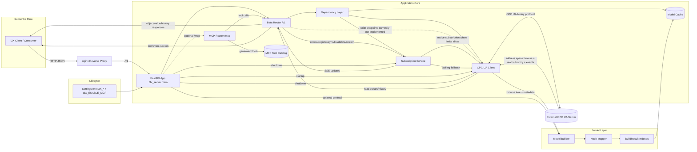
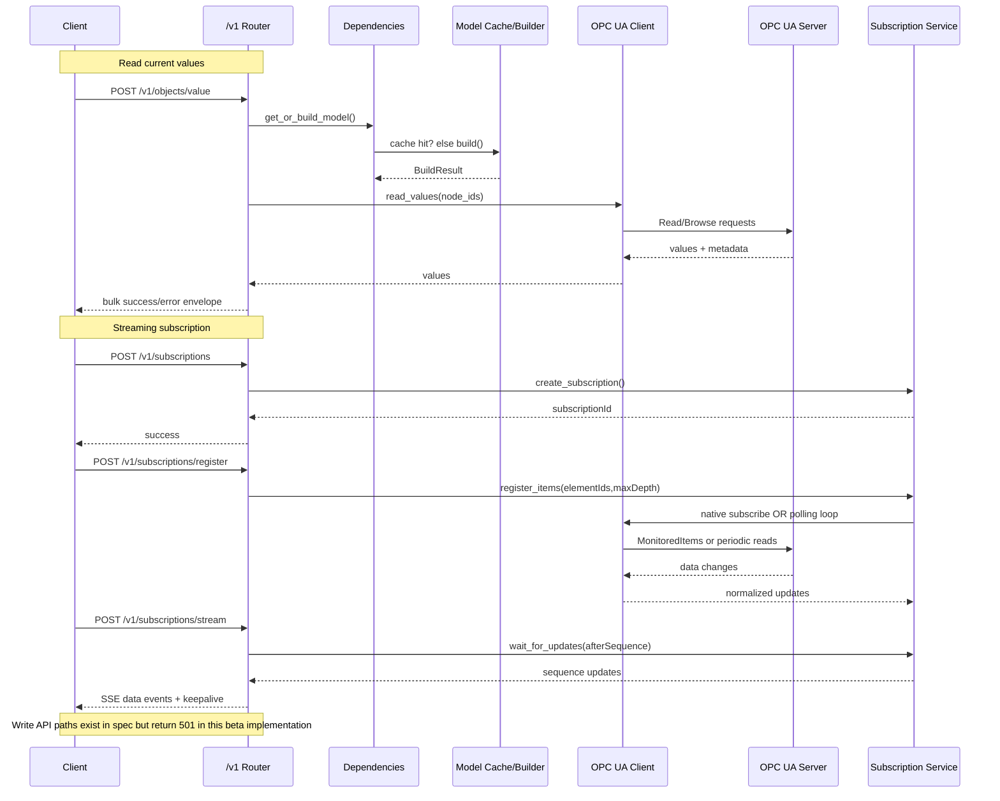

# i3X API Gateway for OPC UA — Browse, Read & Stream Industrial Data

**FastAPI gateway implementing the i3X REST API over OPC UA — exposes OPC UA address spaces as standardized JSON endpoints for browsing, value reads, history, and Server-Sent Event subscriptions.**

[](https://github.com/AndreasHeine/i3x2ua/actions/workflows/docker.yml) [](https://github.com/AndreasHeine/i3x2ua/actions/workflows/quality.yml) [](https://codecov.io/gh/AndreasHeine/i3x2ua) [](https://github.com/AndreasHeine/i3x2ua/actions/workflows/dependabot/dependabot-updates) [](https://github.com/AndreasHeine/i3x2ua/actions/workflows/dependabot/update-graph)


## **Industrial Information Interoperability eXchange (i3X)**

The Industrial Information Interoperability Exchange (i3X™) is an open, common API initiative proposed to address a growing interoperability challenge in modern manufacturing architectures: **manufacturing data silo proliferation and API chaos**. As manufacturers adopt heterogeneous software stacks from multiple vendors, the industry risks repeating past fragmentation seen with protocols, platforms, and namespaces - this time at the API layer.

## License

### Personal use only. 
All rights reserved. See the [LICENSE](LICENSE) file for details.

### Commercial Licensing
Commercial use, distribution, or modification of this code is strictly prohibited under the standard license. If you want to use this project for commercial purposes, please purchase a commercial license.

However, you can automatically acquire a commercial license by sponsoring this project on GitHub. Commercial use is permitted as long as you maintain an active sponsorship at the **[$1 a month]** level or higher.

Get your commercial license instantly here:
* **Become a Sponsor:** [Sponsor me on GitHub](https://github.com/sponsors/AndreasHeine)

Alternatively, for custom licensing agreements or one-time purchases, please contact me directly:
* **Email:** info@andreas-heine.net

## Architecture Overview





## Quick Start

Requirements:

- Python 3.12
- uv
- Optional: running OPC UA server

Install dependencies:

```bash
uv sync --extra dev
```

Start API:

```bash
uv run uvicorn i3x_server.main:app --reload --host 127.0.0.1 --port 8000
```

Start without OPC UA server (PowerShell):

```powershell
$env:I3X_SKIP_OPCUA_CONNECT="1"
uv run uvicorn i3x_server.main:app --reload --host 127.0.0.1 --port 8000
```

Enable MCP support explicitly when you want the `/mcp` endpoints and MCP tool catalog to be available:

```powershell
$env:I3X_ENABLE_MCP="1"
uv run uvicorn i3x_server.main:app --reload --host 127.0.0.1 --port 8000
```

If you do not set `I3X_ENABLE_MCP`, the app starts without MCP support and `/mcp` returns `404`.

OpenAPI/Swagger:

- http://127.0.0.1:8000/openapi.json
- http://127.0.0.1:8000/docs

## API Surface

Active endpoints are exposed under `/v1` for:

- info and metadata (`/info`, `/namespaces`, `/objecttypes`, `/relationshiptypes`)
- object queries and values (`/objects`, `/objects/list`, `/objects/related`, `/objects/value`, `/objects/history`)
- subscriptions (`/subscriptions`, `/subscriptions/register`, `/subscriptions/unregister`, `/subscriptions/sync`, `/subscriptions/list`, `/subscriptions/delete`, `/subscriptions/stream`)

Optional MCP endpoints are exposed only when `I3X_ENABLE_MCP=1`:

- discovery and tool catalog (`/mcp`, `/mcp/tools`)
- JSON-RPC and tool call entry points (`/mcp`, `/mcp/call`)

## Documentation

- Beta contract and conformance: `docs/I3X_CONFORMANCE.md`
- OPC UA to i3X mapping profile: `docs/OPCUA_I3X_MAPPING_PROFILE.md`
- LM Studio / MCP bridge guide: `docs/LM_STUDIO_MCP_GUIDE.md`
- Roadmap and open items: `docs/TODO.md`
- Python coding requirements: `docs/python-coding-reguirements.md`
- API definition: `openapi.json`

## Docker

Run with compose:

```bash
docker compose up -d
```

The stack now starts the API behind an nginx reverse proxy. The app container stays internal, while nginx exposes HTTP and optional HTTPS.

Optional environment variables:

- `I3X_ENABLE_MCP=1` to enable MCP support; it is disabled by default
- `NGINX_HTTPS_ENABLED=1` to enable TLS termination
- `NGINX_SSL_CERTS_DIR=./certs` with `fullchain.pem` and `privkey.pem`
- `NGINX_BASIC_AUTH_ENABLED=1` with `NGINX_BASIC_AUTH_USER` and `NGINX_BASIC_AUTH_PASSWORD`
- `NGINX_SERVER_NAME` for the public host name

If you enable HTTPS, mount or place the certificate files in the configured cert directory before starting Compose.

## Development

```bash
uv run ruff check .
uv run ruff format .
uv run mypy .
uv run pytest -q
uv run pytest -q --cov=i3x_server --cov-report=term-missing
```
