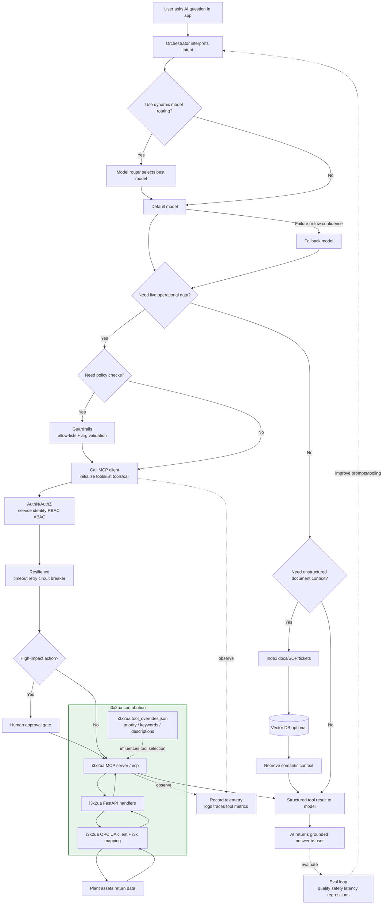

# i3Xua + LM Studio MCP Guide

This guide explains how to connect LM Studio to the native MCP support built into i3xua.

LM Studio is used here as the reference MCP client, but the integration flow also applies to other MCP-capable AI tools.

MCP support is opt-in. Start the server with `I3X_ENABLE_MCP=1` before following the steps below.

Use this guide when you already have the i3Xua server running and want LM Studio to call it as a tool source.

## Integration Flow (Advanced AI Tooling)

The diagram below is a true integration flowchart with a required path and optional advanced branches.



Required integration path: AI app -> orchestrator -> MCP client -> i3xua MCP server -> FastAPI handlers -> OPC UA/plant systems -> response back to the model.

Optional advanced path: add observability, guardrails, semantic retrieval (vector DB), model fallback, approval gates, and continuous evaluations while keeping live operational data grounded through MCP tools.

The green group in the flowchart is the i3x2ua value layer you bring to the AI stack: MCP exposure, API/tool dispatch, industrial data mapping, and tool metadata shaping.

## What You Need

1. The i3Xua server running locally.
2. LM Studio installed.
3. The server reachable at `http://127.0.0.1:8000`.

## Start The Server

Run i3xua the same way you normally start the FastAPI app:

```bash
I3X_ENABLE_MCP=1 \
uv run uvicorn i3x_server.main:app --reload --host 127.0.0.1 --port 8000
```

Before opening LM Studio, confirm these URLs work in a browser:

- `http://127.0.0.1:8000/openapi.json`
- `http://127.0.0.1:8000/mcp`

The first confirms the API is up. The second confirms the MCP endpoint is reachable.

## Add The MCP Server In LM Studio

In LM Studio, add a new MCP server with this URL:

```json
{
    "mcpServers": {
        "i3x-api-mcp": {
            "url": "http://127.0.0.1:8000/mcp"
        }
    }
}
```

Save the config and restart LM Studio if it does not refresh automatically.

## What The Server Exposes

Once LM Studio connects, it will discover tools from the i3X API automatically.

Common tools you can expect include:

- `getInfo`
- `getNamespaces`
- `getObjectTypes`
- `getObjects`
- `queryLastKnownValues`
- `queryHistoricalValues`
- `createSubscription`
- `syncSubscription`

`streamSubscription` is not exposed as a normal tool because it is an SSE stream.

## MCP Capability Matrix

The MCP endpoint is focused on tool calling for the current beta scope.

| Area | Status | Notes |
|------|--------|-------|
| MCP endpoint discovery (`GET /mcp`) | Supported | Returns SSE endpoint discovery payload. |
| JSON-RPC `initialize` | Supported | Basic MCP handshake is implemented. |
| JSON-RPC `tools/list` | Supported | Returns OpenAPI-derived tool catalog (+ overrides). |
| JSON-RPC `tools/call` | Supported | Calls are dispatched internally to the existing REST handlers. |
| JSON-RPC batch requests | Not supported | Send one JSON-RPC message per request. |
| Streaming as MCP tool (`streamSubscription`) | Not exposed | SSE stream remains available via REST subscription endpoint. |
| REST update/write endpoints via MCP tools | Exposed by OpenAPI but optional in beta | Some write/update operations can return `501 Not Implemented`. |

### Beta Scope Reminder

This server currently focuses on read/query/subscribe behavior. Update/write operations are optional in the i3X profile and may not be implemented in this beta.

## Tool Overrides

You can tune tool descriptions, priorities, and keywords by editing [tool_overrides.json](../tool_overrides.json) at the repository root. The server loads that file at startup and merges any matching overrides into the generated MCP tool catalog.

If you want LM Studio to use that metadata more intentionally, add these rules to your system prompt:

```text
Tool selection rules:
- Prefer tools with priority "high".
- Avoid tools with priority "low" unless explicitly asked.
- Match user intent using the tool's keywords.
- Never call getInfo unless the user explicitly asks for server info.
- Choose the tool whose name and description most closely match the user's request.
```

## How To Use It In Prompts

Ask LM Studio questions that map naturally to the API:

- "What namespaces are available?"
- "Show me the current value of sensor-123."
- "Give me the historical values for sensor-123 between these two timestamps."
- "Create a subscription for these objects."

Good behavior to expect:

- Use `getNamespaces` or `getObjectTypes` for exploration.
- Use `queryLastKnownValues` for current or last-known values.
- Use `queryHistoricalValues` for time-range questions.
- Use `createSubscription` and `syncSubscription` for live updates.

## Verify It Works

If LM Studio does not see the server, check these items in order:

1. The i3Xua server is still running.
2. `http://127.0.0.1:8000/mcp` returns a response.
3. The LM Studio config points to `http://127.0.0.1:8000/mcp` exactly.
4. Restart LM Studio after editing the config.

If tool calls fail, the most common causes are:

- The server was restarted and LM Studio still has an old connection.
- The model asked for a value that does not exist in the address space.
- The request was too broad or missing required fields.
- The chosen tool maps to an optional beta operation that currently returns `501 Not Implemented`.

## Troubleshooting

If the server shows `404` for `/mcp`, make sure you are running the updated i3xua server version that includes the native MCP endpoint.

If `/mcp` still returns `404`, confirm that `I3X_ENABLE_MCP=1` is set in the server process environment before startup.

If LM Studio reports a plugin exit or SSE error, restart both the server and LM Studio, then re-check the URL in the config.

If you want to test the endpoint manually, open `http://127.0.0.1:8000/mcp` first, then use LM Studio after that response is confirmed.