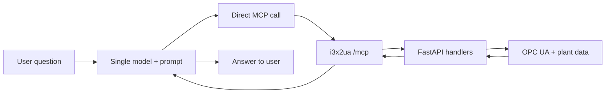
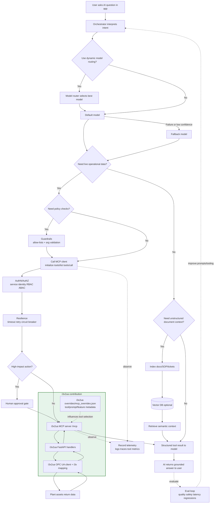

# Reference Architecture

## Integration Flow (Simple Baseline)

This baseline is useful for fast local prototyping with minimal moving parts.

Simple path: user -> model -> MCP call -> i3x2ua MCP server -> FastAPI handlers -> OPC UA/plant systems -> response back to the model.

### Limitations of the Simpler Approach

- Lower reliability under production load because there is no explicit timeout/retry/circuit-breaker layer.
- Weaker governance because policy checks and argument guardrails are not modeled as a separate control gate.
- Higher operational risk for write/update actions because no human-approval checkpoint is included.
- Less predictable tool behavior because tool-priority and keyword-driven routing are not emphasized in orchestration.
- Reduced observability because telemetry/evaluation loops are not first-class parts of the flow.
- No retrieval branch for unstructured context, so answers depend mostly on live tool outputs and prompt context.

## Integration Flow (Advanced AI Tooling)

The diagram below is a true integration flowchart with a required path and optional advanced branches.

Required integration path: AI app -> orchestrator -> MCP client -> i3xua MCP server -> FastAPI handlers -> OPC UA/plant systems -> response back to the model.

Optional advanced path: add observability, guardrails, semantic retrieval (vector DB), model fallback, approval gates, and continuous evaluations while keeping live operational data grounded through MCP tools.

The green group in the flowchart is the i3x2ua value layer you bring to the AI stack: MCP exposure, API/tool dispatch, industrial data mapping, and tool metadata shaping.
