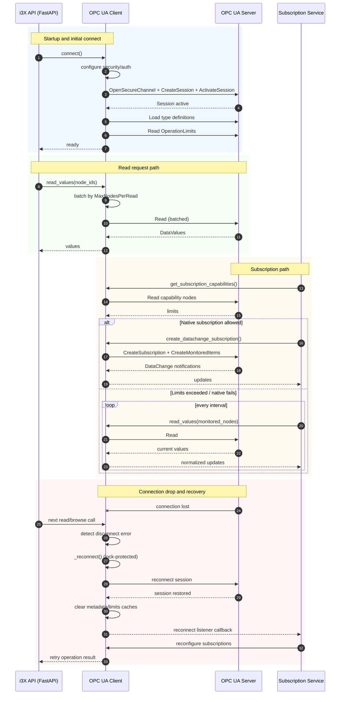

# OPC UA Client Documentation (Non-Expert Guide)

This document explains what the OPC UA client does inside this application, how it is optimized, and how it behaves during connection loss and reconnect.

## What The OPC UA Client Does In This Application

Think of the OPC UA client as a translator and transport layer between:

- your i3X REST/MCP API consumers (HTTP clients), and
- the external OPC UA server (industrial data source).

At runtime, the OPC UA client is responsible for:

- opening and maintaining the OPC UA session,
- discovering the OPC UA address space (browse),
- reading live values and historical values,
- loading namespaces and object type metadata,
- supporting method calls,
- creating monitored-item subscriptions for real-time updates,
- recovering from dropped OPC UA connections.

In short: the API never talks directly to OPC UA. All OPC UA communication goes through this client.

## Where It Is Used In The App

- Startup: the app creates one shared OPC UA client instance and connects once.
- Model build/preload: the model builder uses the client to browse nodes and build i3X structures.
- Read endpoints: value/history endpoints call the client to fetch data.
- Subscription endpoints: the subscription service uses the client for native OPC UA monitored items or for polling fallback.

## Connection Behavior

## Connect

During startup, the client performs these phases:

1. Configure security (if enabled).
2. Connect session with asyncua auto-reconnect enabled.
3. Load additional OPC UA type definitions.
4. Read and cache operational limits from the server.

This keeps the connection setup explicit and gives the app server-aware limits before heavy browse/read operations start.

## Reconnect

The client handles transient disconnects with retry + reconnect logic:

- For common disconnected-session errors (for example: "connection is closed"), it attempts reconnect and retries the operation.
- Reconnect is protected by a lock, so only one reconnect sequence runs at a time.
- On reconnect, metadata/limits caches are cleared and rebuilt lazily when needed.
- After reconnect, registered listeners are notified. The subscription service uses this to reconfigure native subscriptions automatically.

Practical effect for users:

- Temporary OPC UA outages usually cause short delays, not full API restart requirements.
- Native subscriptions are re-established after reconnect when possible.

## Operational Limits And How They Are Used

The client reads server-side limits from OPC UA `ServerCapabilities.OperationLimits` and applies them in request planning.

Main limits used:

- `MaxNodesPerBrowse`
- `MaxNodesPerRead`

How this helps:

- Browse/read requests are split into batches that respect server capabilities.
- This reduces `BadTooManyOperations` errors and avoids oversized single requests.

If limits cannot be read, safe defaults are used and warnings are logged.

## Concurrency Model

Concurrency is intentionally controlled, not unlimited.

Key controls:

- `I3X_OPCUA_BROWSE_CONCURRENCY` (default 128 in settings) controls parallel worker count for fallback browse/history/member reads.
- For many operations, the client prefers batched reads first, then falls back to per-node workers behind a semaphore when required.

Why this matters:

- Too little concurrency increases latency.
- Too much concurrency can overload smaller OPC UA servers.
- The combination of batching + semaphore provides stable throughput across different server sizes.

## Subscription Optimization

The subscription service first attempts native OPC UA subscriptions, then falls back to polling if server limits would be exceeded.

Capability checks include:

- maximum monitored items per call/subscription,
- maximum subscriptions,
- maximum monitored items total,
- maximum subscriptions per session.

Decision logic:

- If limits allow: use native monitored items (push from OPC UA server).
- If limits do not allow (or native setup fails): use polling mode at configured interval.

This protects reliability in constrained environments while still enabling real-time behavior where possible.

## Metadata Caching

To reduce repeated expensive metadata calls:

- namespace info and object type information are cached with TTL,
- operational limits and subscription capabilities are cached,
- caches are invalidated on reconnect.

Relevant setting:

- `I3X_OPCUA_METADATA_CACHE_TTL_SECONDS` (default 300).

## Security And Authentication

The client supports:

- anonymous session,
- username/password session,
- OPC UA secure channel with certificates.

When security mode is not `None`, policy + certificate + key must be configured, otherwise startup fails fast with a clear configuration error.

## Sample Client Certificate (Encrypted Connection)

This repository includes a sample OPC UA client certificate/key pair for local encrypted connection tests:

- `certs/opcua-client-sample/client-cert.pem`
- `certs/opcua-client-sample/client-key.pem`

To generate or refresh these files with an OPC UA-compatible profile:

```bash
uv run python scripts/generate_opcua_client_cert.py
```

Use it with these environment variables:

```powershell
$env:I3X_OPCUA_SECURITY_MODE="SignAndEncrypt"
$env:I3X_OPCUA_SECURITY_POLICY="Basic256Sha256"
$env:I3X_OPCUA_CLIENT_CERT_PATH="./certs/opcua-client-sample/client-cert.pem"
$env:I3X_OPCUA_CLIENT_KEY_PATH="./certs/opcua-client-sample/client-key.pem"
# Optional but recommended when your server requires pinning/trust by certificate file
# $env:I3X_OPCUA_SERVER_CERT_PATH="./certs/opcua-server/server-cert.pem"
uv run uvicorn i3x_server.main:app --reload --host 127.0.0.1 --port 8000
```

Important:

- The sample certificate is for development/testing only.
- Many OPC UA servers require trusting the client certificate in their trust list before connection succeeds.
- For production, generate and manage your own certificates and private keys.

When generating your own OPC UA client certificate, include at least:

- SAN application URI compatible with your client application identity (for `asyncua` default, `urn:example.org:FreeOpcUa:opcua-asyncio`)
- SAN DNS entries for `localhost` and host name(s) used by deployment
- Key Usage: `digitalSignature`, `nonRepudiation/contentCommitment`, `keyEncipherment`, `dataEncipherment`
- EKU: `clientAuth` (and optionally `serverAuth` for broader compatibility)

If these fields are missing or too restrictive, servers may reject the secure channel with errors like `BadCertificateUseNotAllowed`.

## Sequence Diagram: OPC UA Client And Server Communication



## Key Environment Variables

- `I3X_OPCUA_ENDPOINT`
- `I3X_OPCUA_USERNAME`
- `I3X_OPCUA_PASSWORD`
- `I3X_OPCUA_SECURITY_MODE`
- `I3X_OPCUA_SECURITY_POLICY`
- `I3X_OPCUA_CLIENT_CERT_PATH`
- `I3X_OPCUA_CLIENT_KEY_PATH`
- `I3X_OPCUA_CLIENT_KEY_PASSWORD`
- `I3X_OPCUA_SERVER_CERT_PATH`
- `I3X_OPCUA_BROWSE_CONCURRENCY`
- `I3X_OPCUA_METADATA_CACHE_TTL_SECONDS`
- `I3X_SUBSCRIPTION_INTERVAL_SECONDS`

## Operational Guidance (Simple)

- Start with default concurrency and observe latency/error logs.
- If OPC UA server is small/embedded: reduce browse concurrency.
- If metadata calls are frequent: increase metadata cache TTL.
- If native subscriptions are frequently downgraded to polling: check server subscription capability limits.
