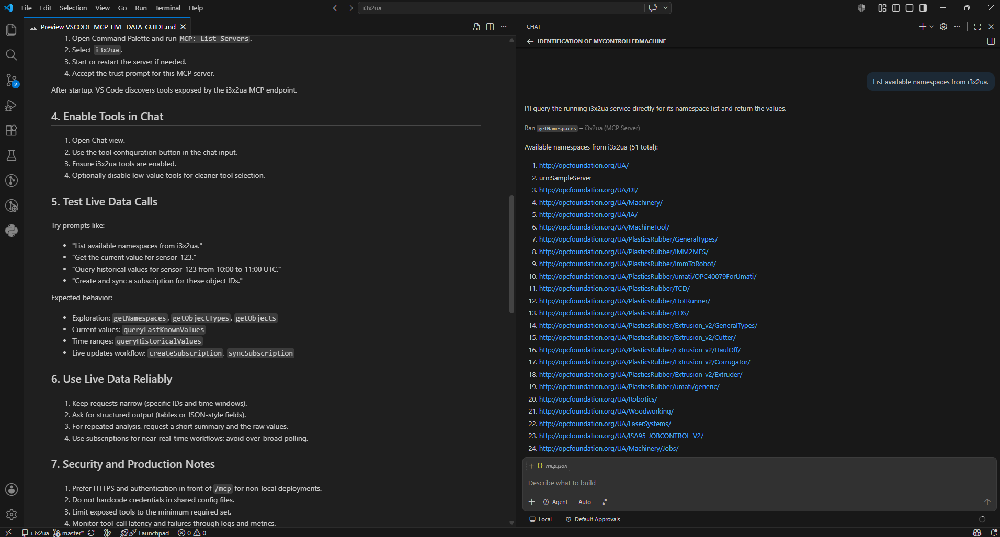

# i3x2ua + Visual Studio Code MCP Live Data Guide

This guide shows how to connect Visual Studio Code chat to the i3x2ua MCP server and use live industrial data directly in the editor.

LM Studio is covered in a separate guide. This document focuses on Visual Studio Code as the MCP client.

## Prerequisites

1. Visual Studio Code with chat/tool support enabled.
2. The i3x2ua server running locally or on a reachable host.
3. MCP enabled on i3x2ua (`I3X_ENABLE_MCP=1`).
4. Network access from VS Code to the i3x2ua MCP endpoint.

## 1. Start i3x2ua with MCP Enabled

PowerShell example:

```powershell
$env:I3X_ENABLE_MCP="1"
uv run uvicorn i3x_server.main:app --reload --host 127.0.0.1 --port 8000
```

Verify both endpoints:

- `http://127.0.0.1:8000/openapi.json`
- `http://127.0.0.1:8000/mcp`

If `/mcp` returns `404`, MCP is not enabled in the server process.

## 2. Add the MCP Server in VS Code

You can add servers with Command Palette (`MCP: Add Server`) or by editing `mcp.json` directly.

Workspace configuration path:

- `.vscode/mcp.json`

Minimal configuration for i3x2ua:

```json
{
  "servers": {
    "i3x2ua": {
      "type": "http",
      "url": "http://127.0.0.1:8000/mcp"
    }
  }
}
```

Notes:

- Workspace config is best when you want teammates to share the same MCP setup.
- User-profile config is best when you want this server available in all workspaces.

## 3. Trust and Start the Server

1. Open Command Palette and run `MCP: List Servers`.
2. Select `i3x2ua`.
3. Start or restart the server if needed.
4. Accept the trust prompt for this MCP server.

After startup, VS Code discovers tools exposed by the i3x2ua MCP endpoint.

## 4. Enable Tools in Chat

1. Open Chat view.
2. Use the tool configuration button in the chat input.
3. Ensure i3x2ua tools are enabled.
4. Optionally disable low-value tools for cleaner tool selection.

## 5. Test Live Data Calls

Try prompts like:

- "List available namespaces from i3x2ua."
- "Get the current value for sensor-123."
- "Query historical values for sensor-123 from 10:00 to 11:00 UTC."
- "Create and sync a subscription for these object IDs."

Expected behavior:

- Exploration: `getNamespaces`, `getObjectTypes`, `getObjects`
- Current values: `queryLastKnownValues`
- Time ranges: `queryHistoricalValues`
- Live updates workflow: `createSubscription`, `syncSubscription`



## 6. Use Live Data Reliably

1. Keep requests narrow (specific IDs and time windows).
2. Ask for structured output (tables or JSON-style fields).
3. For repeated analysis, request a short summary and the raw values.
4. Use subscriptions for near-real-time workflows; avoid over-broad polling.

## 7. Security and Production Notes

1. Prefer HTTPS and authentication in front of `/mcp` for non-local deployments.
2. Do not hardcode credentials in shared config files.
3. Limit exposed tools to the minimum required set.
4. Monitor tool-call latency and failures through logs and metrics.

## 8. Troubleshooting

### MCP server not visible in chat

- Confirm `.vscode/mcp.json` is valid JSON.
- Run `MCP: List Servers` and verify `i3x2ua` is enabled.
- Restart the MCP server from the MCP command menu.

### `/mcp` returns `404`

- Restart i3x2ua with `I3X_ENABLE_MCP=1`.
- Confirm you are calling the same host and port where i3x2ua is running.

### Tools exist but calls fail

- Verify the OPC UA backend is reachable and contains requested IDs.
- Reduce query scope (fewer IDs, tighter date range).
- Check if the selected operation is optional beta behavior that may return `501 Not Implemented`.

### No live updates appear

- Ensure subscription creation and sync succeeded before expecting stream updates.
- Check server logs for subscription lifecycle errors.

## 9. Recommended Team Setup

1. Commit `.vscode/mcp.json` with non-secret defaults.
2. Keep environment-specific hostnames in user config or environment variables.
3. Add a short shared prompt policy for tool selection and safety.

With this setup, Visual Studio Code chat can call i3x2ua tools directly and ground responses in live plant data.
