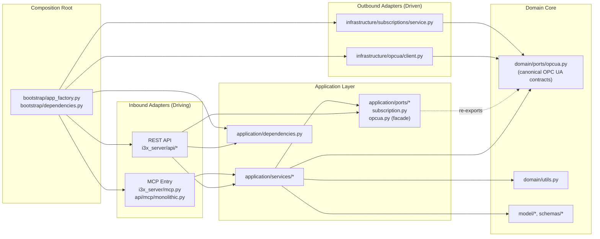

# Architecture Overview

## Purpose

This document defines module ownership and dependency direction for the i3x2ua codebase. It is intended to keep refactor outcomes stable as new features are added.

## Hexagonal Architecture Diagram (Current State)

## Layer Model

The project follows a layered architecture inside i3x_server:

1. presentation
- Responsibility: protocol-facing endpoints, request parsing, response shaping, protocol adapters (REST and MCP).
- Current primary modules: i3x_server/api, i3x_server/mcp.py, i3x_server/api/v1/monolithic.py, i3x_server/api/mcp/monolithic.py.

2. application
- Responsibility: use-case orchestration, coordination between services, cross-cutting workflow logic.
- Current primary modules: i3x_server/application/services, i3x_server/application/dependencies.py.

3. domain
- Responsibility: protocol-agnostic rules and reusable core utilities.
- Current primary modules: i3x_server/domain.

4. infrastructure
- Responsibility: external systems and I/O adapters (OPC UA transport, filesystem access, external client concerns).
- Current primary modules: i3x_server/infrastructure/opcua and i3x_server/infrastructure/subscriptions/service.py.

5. bootstrap
- Responsibility: app assembly, startup/shutdown lifecycle, middleware composition.
- Current primary modules: i3x_server/bootstrap.

## Dependency Direction

Allowed direction:

presentation -> application -> domain
presentation -> domain (only for thin DTO/helpers when no orchestration is needed)
application -> domain
application -> infrastructure (through stable interfaces or adapter seams)
bootstrap -> presentation/application/infrastructure

Disallowed direction:

- domain importing presentation
- domain importing FastAPI, Starlette, or protocol route modules
- domain importing direct network/framework runtime primitives
- presentation directly orchestrating deep OPC UA workflows when an application service exists

## Ownership Guide

When adding code, prefer the following placement:

- New HTTP endpoint or MCP method handler: presentation (api/*)
- Multi-step business workflow invoked by endpoint: application/services/*
- Pure transformation or rule used by multiple services: domain/*
- External client, filesystem, transport adapter: infrastructure-oriented module (currently opcua/* or dedicated infrastructure package)
- Startup wiring, state initialization, middleware policy: bootstrap/*

## Transitional Rules

During migration, compatibility wrappers are expected:

- i3x_server/api/v1/__init__.py wraps i3x_server.api.v1.monolithic exports
- i3x_server/api/mcp/__init__.py wraps i3x_server.api.mcp.monolithic exports

For private internals, tests and monkeypatching must target source modules, not wrapper re-exports.

## File Size Guidance

Soft limits:

- Preferred: <= 400 lines per module
- Warning zone: > 600 lines
- Refactor required: > 900 lines unless strongly justified

If a module crosses 600 lines, add a follow-up issue or refactor note with an extraction plan.

## Testing Alignment

Feature tests should live under tests/features/<feature_name>/ and map to runtime ownership:

- API presentation behavior: tests/features/*
- application service behavior: tests/application/* (as introduced)
- infrastructure adapter behavior: tests/infrastructure/* (as introduced)

## Change Safety Checklist

Before merging architecture-affecting work:

1. ruff check and format pass
2. mypy passes
3. pytest passes with coverage gate
4. route behavior parity maintained unless change is explicitly planned
5. imports follow allowed dependency direction
